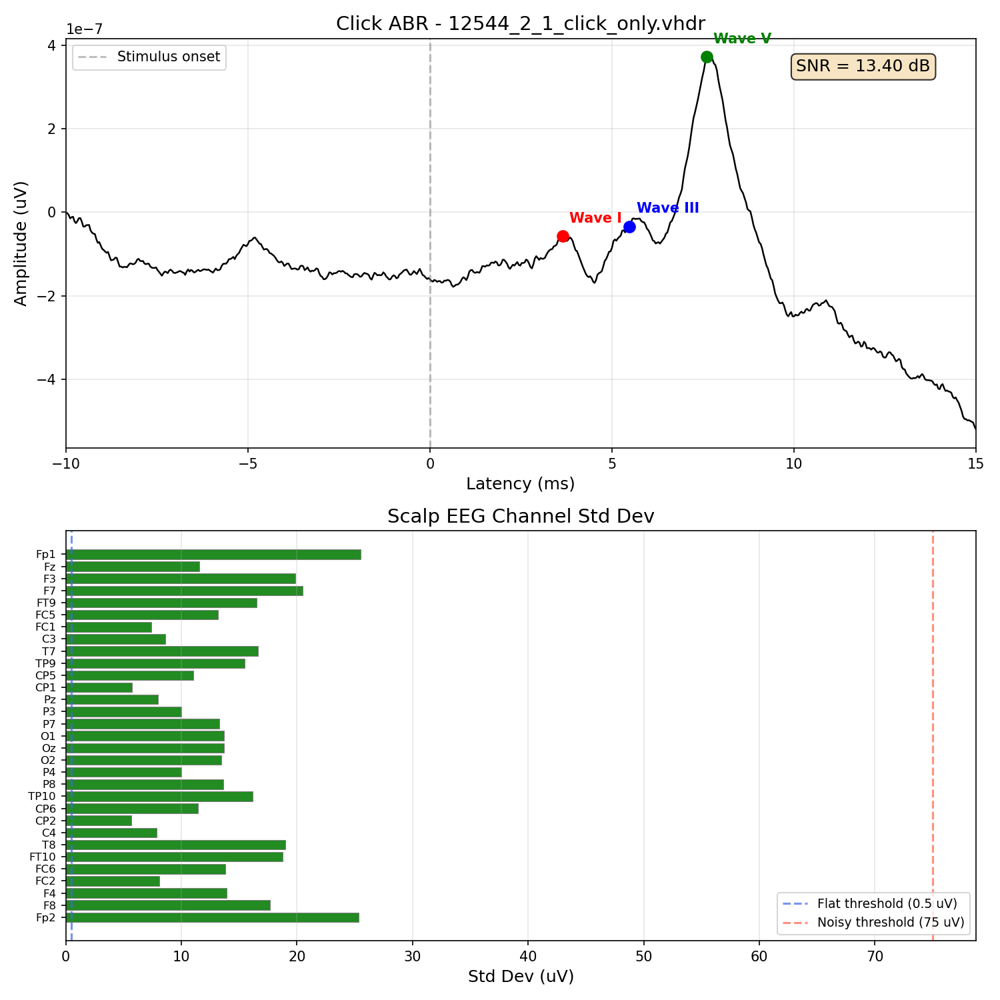

# PRT EEG Experiment

Prosody Recognition Task (PRT) EEG experiment repository. Contains audio stimuli preprocessing tools, experiment presentation scripts, and EEG quality control tools for research on emotional prosody (happy/sad).

## Repository Structure

```
PRT_EEG/
├── code/
│   ├── stimuli_preprocessing/         # Audio analysis and preprocessing tools
│   ├── experiment/                    # Experiment presentation scripts
│   │   ├── prt_click_presentation.py  # Click train presentation & sound check
│   │   ├── prt_story_presentation.py  # Story presentation & comprehension questions
│   │   └── sound_calibration.py       # Post-session sound calibration
│   ├── click_QC/                      # Click ABR quality control
│   │   └── click_qc.py               # CLI tool for ABR signal QC (run after recording)
│   └── analysis/                      # Analysis scripts
│       └── check_click_quality.py     # Original ABR analysis (reference)
├── stimuli/                           # Root-level audio stimuli files (.wav)
├── stim_normalized/                   # Normalized stimuli used by the experiment
│   └── click/                         # Click WAV files (click000.wav - click004.wav)
├── data/                              # Experiment data (not tracked in git)
└── docs/plans/                        # Design docs and implementation plans
```

## Setup

### Python Dependencies

Install the required packages:

```bash
pip install numpy scipy matplotlib mne expyfun librosa pandas sounddevice pybv
```

**Note:** `expyfun` and `sounddevice` are only needed on the EEG computer. `librosa` and `pandas` are only needed for audio preprocessing.

## Running the Experiment (Windows EEG Computer)

Double-click **`run_experiment.bat`** in the project folder. It activates the conda environment and shows a menu:

```
========================================
  PRT EEG Experiment
========================================

  1. Click Presentation (run first)
  2. Story Presentation
  3. Post-Session Calibration
  4. Exit

Select option (1-4):
```

Each script will prompt you for participant ID (5-digit), and (for stories) visit number (1-digit), session number (1-digit), and presentation order (A/B/C/D).

**First-time setup:** Install dependencies in the `ABR` conda environment via Anaconda Prompt:
```
conda activate ABR
pip install numpy scipy matplotlib mne expyfun sounddevice pandas
```

**Note:** If the batch file can't find Anaconda, open the file in a text editor and update the path to match your Anaconda install location. Run `where conda` in Anaconda Prompt to find it.

## Experiment Workflow

The experiment session follows this order:

1. **Click presentation** — select option 1 from the launcher (sound check + 5 minutes of click trains)
2. **Click QC** — run `click_qc.py` on a separate analysis computer to verify ABR signal quality
3. **Story experiment** — select option 2 from the launcher (~30 min of stories + questions)
4. **Post-session calibration** — select option 3 from the launcher (loops a speech recording for volume calibration)

---

## Click Presentation

**Script:** `code/experiment/prt_click_presentation.py`

Presents click trains for ABR recording. Run this BEFORE the main story experiment.

### What it does

1. **Sound check** — plays 10 seconds of a story segment so the participant can confirm they hear it clearly
2. **Click trains** — presents 5 click WAV files (~1 minute each) with a fixation cross on screen
3. **End prompt** — confirms completion

### How to run

On the EEG computer, use the launcher (see [Running the Experiment](#running-the-experiment-windows-eeg-computer)) and select option 1. Or run directly:

```bash
python code/experiment/prt_click_presentation.py
```

The script will prompt you interactively:

```
========================================
  PRT Click Presentation & Sound Check
========================================

Enter participant ID (5 digits, e.g., 12544): 12544
Enter visit number (1 digit, e.g., 1): 1
Enter session number (1 digit, e.g., 1): 1
```

### Output files

Data log and tab files are saved as `click_{PID}_{visit}_{session}_{date}.tab` and `.log`.

### Important notes

- Stimulus files must be in `stim_normalized/click/` (click000.wav through click004.wav)
- Sound check file: `stim_normalized/12008_1_1_happy/story/12008_1_1_happy_studio.wav`
- Stimulus volume is set to 65 dB
- Press **Space** to advance between screens
- Press **End** to force quit

---

## Click ABR Quality Control

**Script:** `code/click_QC/click_qc.py`

Run this immediately after the click recording session to check ABR signal quality before continuing with the story experiment.

### How to run

**Option 1 — Double-click the batch file** (Windows):

Double-click **`code/click_QC/run_click_qc.bat`**. It activates the `ABR` conda environment and prompts for the `.vhdr` file path:

```
========================================
  Click ABR Quality Control
========================================

Enter path to .vhdr file: data\subject01\subject01_clicks.vhdr
```

**Option 2 — Run directly from the command line:**

```bash
python code/click_QC/click_qc.py <path_to_vhdr_file>
```

**Example:**

```bash
python code/click_QC/click_qc.py data/subject01/subject01_clicks.vhdr
```

If the click WAV files are not in the default location (`stim_normalized/click/`), specify the path:

```bash
python code/click_QC/click_qc.py data/subject01/subject01_clicks.vhdr --stim_path /path/to/click/files
```

### What it checks

#### 1. ABR Signal Quality

Derives the Auditory Brainstem Response (ABR) via cross-correlation of EEG with click stimuli, then evaluates:

- **SNR** (Signal-to-Noise Ratio) using the method from [Shan et al. (2023), *Scientific Reports*](https://www.nature.com/articles/s41598-023-50438-0)
- **ABR peak detection** for Waves I, III, and V

**Quality ratings based on SNR:**

| SNR | Rating |
|-----|--------|
| > 6 dB | GOOD |
| 3–6 dB | ACCEPTABLE |
| 0–3 dB | MARGINAL |
| < 0 dB | POOR |

#### 2. Scalp EEG Channel Quality

Checks all scalp EEG channels (excluding ABR-specific and Audio channels) for noise levels:

- Bandpass filters to 1–100 Hz, then computes standard deviation per channel
- **Flat** (< 0.5 uV): channel may have a bad connection
- **Noisy** (> 75 uV): channel has excessive noise

### Output files

Both files are saved alongside the input `.vhdr` file:

1. **`{basename}_abr_qc.png`** — Two-panel figure:
   - Top: ABR waveform (−10 to 15 ms) with Wave I/III/V peak annotations and SNR text box
   - Bottom: Horizontal bar chart of per-channel standard deviation with flat/noisy thresholds

2. **`{basename}_abr_qc.txt`** — Full text report including:
   - SNR value and variance components
   - Peak latencies and amplitudes for Waves I, III, V
   - Overall quality rating
   - Scalp EEG channel table with status flags

### What to look for

- **SNR should be at least 3 dB** (ACCEPTABLE or better) to proceed with the story experiment
- **Wave V should be clearly visible** around 5–9 ms
- **All scalp channels should be OK** — if channels are flagged as FLAT or NOISY, check electrode connections before proceeding

### Example output

**Figure** (`_abr_qc.png`):



**Text report** (`_abr_qc.txt`):

```
============================================================
         CLICK ABR QUALITY CONTROL REPORT
============================================================
Date:           2026-03-03 12:40:05
EEG File:       12544_2_1_click_only.vhdr
Sampling Rate:  25000.0 Hz
Epochs Used:    5

------------------------------------------------------------
  SNR Analysis
------------------------------------------------------------
  sigma^2_S+N (signal+noise var):  3.521692e-14
  sigma^2_N   (noise var):         1.539341e-15
  SNR:                             13.40 dB

------------------------------------------------------------
  ABR Peak Detection
------------------------------------------------------------
  Wave   I:  3.64 ms  |  -0.0000 uV
  Wave III:  5.48 ms  |  -0.0000 uV
  Wave   V:  7.60 ms  |  0.0000 uV

------------------------------------------------------------
  Quality Summary
------------------------------------------------------------
  GOOD - SNR above 6 dB
  Wave V detected at 7.60 ms

------------------------------------------------------------
  Scalp EEG Channel QC
------------------------------------------------------------
  Total channels:  31
  OK:              31
  Flat:            0
  Noisy:           0

  Channel       Std Dev (uV)  Status
  ------------  ----------  ------
  Fp1                25.49  OK
  Fz                 11.56  OK
  F3                 19.85  OK
  ...
  Fp2                25.35  OK
============================================================
```

---

## Story Presentation

**Script:** `code/experiment/prt_story_presentation.py`

Presents 8 emotional prosody stories (~30 min total) with comprehension questions. Run this AFTER the click QC passes.

### How to run

On the EEG computer, use the launcher (see [Running the Experiment](#running-the-experiment-windows-eeg-computer)) and select option 2. Or run directly:

```bash
python code/experiment/prt_story_presentation.py
```

The script will prompt you interactively:

```
========================================
  PRT Story Presentation Experiment
========================================

Enter participant ID (5 digits, e.g., 12544): 12544
Enter visit number (1 digit, e.g., 1): 1
Enter session number (1 digit, e.g., 1): 1
Enter story order (A, B, C, or D): A
```

### Output files

Data log and tab files are saved as `story_{PID}_{visit}_{session}_{date}.tab` and `.log`.

### Stimulus pool

All participants receive the same 8 stories (~29.5 min total audio), but in different orders depending on the order selected at the prompt:

| Story | Emotion | Duration |
|-------|---------|----------|
| 12008_1_1_sad | sad | 5.6 min |
| 12008_1_2_happy | happy | 4.7 min |
| 12008_1_2_sad | sad | 2.4 min |
| 12014_1_2_happy | happy | 2.3 min |
| 12015_1_2_sad | sad | 2.4 min |
| 12016_1_1_happy | happy | 6.9 min |
| 12016_1_2_happy | happy | 3.5 min |
| 9227_3_1_spontaneous | spontaneous | 1.9 min |

Each story is followed by 5 comprehension questions (3 multiple-choice + 2 free response). The stimulus pool is defined in `code/stimuli_preprocessing/story_questions_mapping_pool.csv`.

### Presentation orders

Stories are pseudo-randomized using a Latin square design. Each story appears in each position at most once across the 4 orders. Orders also ensure no consecutive same-speaker stories (e.g., 12008's 3 stories are always separated) and max 1 consecutive same-emotion pair per order.

| Position | Order A | Order B | Order C | Order D |
|----------|---------|---------|---------|---------|
| 1 | 12008_1_2 (sad) | 12008_1_2 (happy) | 12014_1_2 (happy) | 12016_1_1 (happy) |
| 2 | 12016_1_2 (happy) | 12014_1_2 (happy) | 12008_1_2 (happy) | 12008_1_1 (sad) |
| 3 | 12008_1_1 (sad) | 12015_1_2 (sad) | 9227_3_1 (spon.) | 12014_1_2 (happy) |
| 4 | 9227_3_1 (spon.) | 12016_1_1 (happy) | 12008_1_1 (sad) | 12008_1_2 (happy) |
| 5 | 12008_1_2 (happy) | 12008_1_2 (sad) | 12016_1_1 (happy) | 12015_1_2 (sad) |
| 6 | 12015_1_2 (sad) | 12016_1_2 (happy) | 12008_1_2 (sad) | 9227_3_1 (spon.) |
| 7 | 12016_1_1 (happy) | 12008_1_1 (sad) | 12016_1_2 (happy) | 12008_1_2 (sad) |
| 8 | 12014_1_2 (happy) | 9227_3_1 (spon.) | 12015_1_2 (sad) | 12016_1_2 (happy) |

Assign orders to participants in rotation: participant 1 → A, participant 2 → B, participant 3 → C, participant 4 → D, participant 5 → A, etc.

### What it does

1. **Instructions** — 2 instruction screens explaining the task
2. **For each story:**
   - Displays "Story X of 8", press Space to begin
   - Plays story audio with fixation cross on screen
   - Presents 5 questions: audio plays while question text and answer options are displayed
   - Experimenter presses Space after participant responds verbally
3. **End prompt** — thanks the participant

### Important notes

- Stimulus files must be in `stim_normalized/` with the directory structure matching the CSV paths
- Experimenter controls pacing with **Space** between stories and after each question
- Press **End** to force quit
- The script allows starting from any story number (prompted at launch)

---

## Post-Session Calibration

**Script:** `code/experiment/sound_calibration.py`

Plays a speech recording on loop through expyfun at `stim_db=65` for volume calibration. Run this AFTER the story experiment.

### How to run

On the EEG computer, use the launcher (see [Running the Experiment](#running-the-experiment-windows-eeg-computer)) and select option 3. Or run directly:

```bash
python code/experiment/sound_calibration.py
```

### What it does

1. Loads a story WAV file (`stim_normalized/12008_1_1_happy/story/12008_1_1_happy_studio.wav`)
2. Opens an expyfun window with `stim_db=65` (same level used during the experiment)
3. Plays the speech recording on loop
4. Press **Space** to stop playback, or **End** to force quit

---

## Audio Stimuli

### Naming Convention

Audio files follow the pattern: `{SubjectID}_{session}_{emotion}_{device}_q{number}.wav`

| Field | Values | Example |
|-------|--------|---------|
| SubjectID | speaker ID number | 12008 |
| session | 1 or 2 | 1 |
| emotion | happy or sad | happy |
| device | nvidia or studio | studio |
| q{number} | question 1–5 | q3 |

### Audio Analysis

To analyze WAV files in the `stimuli/` directory:

```bash
python3 code/stimuli_preprocessing/analyze_wav_files.py
```

This extracts format info, duration, RMS, peak amplitude, pitch (F0), and spectral features, and saves results to `wav_analysis_results.csv`.

---

## EEG Recording Parameters

| Parameter | Value |
|-----------|-------|
| EEG sampling rate | 25,000 Hz |
| Stimulus sampling rate | 48,000 Hz |
| Click rate | 40 Hz |
| Click duration | ~60s per file (5 files total) |
| Stimulus volume | 65 dB |
| ABR channels | Plus_R, Minus_R, Plus_L, Minus_L |
| File format | BrainVision (.vhdr/.vmrk/.eeg) |

### ABR Channel Re-referencing

- Right ear: Plus_R − Minus_R → EP1
- Left ear: Plus_L − Minus_L → EP2
